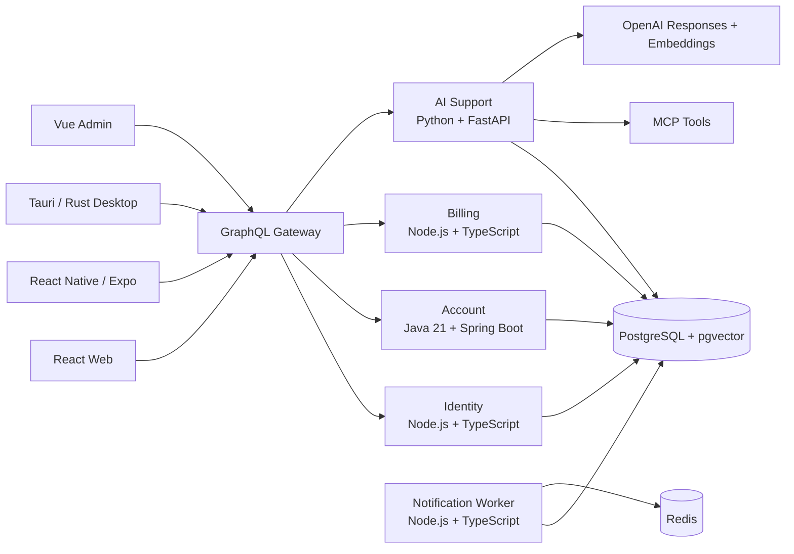

# Pulse Account Management Platform

Pulse is a production-oriented, multi-platform telecom account management system built to demonstrate how customer identity, account servicing, billing, notifications, AI support and operational tooling can work together across web, mobile and desktop clients.

The repository contains two complementary implementations:

1. `platform/` is the current production-oriented system.
2. `APIs/pulse_account_management/` is the original Python behavioral simulator retained as a regression and domain-reference implementation.

## Why this project exists

Telecom account servicing usually spans multiple systems. Customers need to manage profile details, plans, devices, upgrades, bills and support. Support teams need controlled cross-account access. AI assistants need grounded knowledge and safe tools without becoming an authorization authority.

Pulse models that real-world problem as a polyglot platform with explicit service boundaries, customer ownership checks, durable workflows, RAG-based support and release automation.

## Architecture



## Technology stack

| Layer | Technology |
|---|---|
| Customer web | React, TypeScript, Vite |
| Mobile | React Native, Expo, TypeScript |
| Desktop | Tauri, Rust, React, TypeScript |
| Support/admin | Vue 3, TypeScript |
| API gateway | Node.js, TypeScript, GraphQL Yoga |
| Identity | Node.js, TypeScript, Fastify, JWT |
| Account domain | Java 21, Spring Boot |
| Billing | Node.js, TypeScript, Fastify |
| AI support | Python, FastAPI, OpenAI, RAG, pgvector, MCP |
| Data | PostgreSQL 16, pgvector, Redis |
| Delivery | Docker Compose, Kubernetes manifests, GitHub Actions, GHCR |

## Implemented product workflows

Pulse currently demonstrates registration and login, short-lived access tokens, refresh-token rotation, logout revocation, password reset, optional MFA challenges, account profile reads and updates, plan catalog browsing, device upgrade eligibility, order history, invoice retrieval, sandbox payment settlement, scheduled plan changes and durable queued notifications.

Customer-scoped GraphQL operations verify that the requested account belongs to the authenticated user. Support and administrative roles can receive controlled elevated access. Internal account and billing services require a service credential instead of trusting arbitrary network callers.

## AI engineering

The AI support service is more than a chat endpoint. It includes:

- Retrieval-augmented generation over `knowledge_documents`
- OpenAI embeddings and Responses API
- pgvector similarity search
- grounded source citations
- prompt-injection pattern blocking
- explicit insufficient-context behavior
- MCP tools for account and invoice reads
- an approval-required plan-change drafting tool
- AI evaluation datasets and measurable retrieval/safety checks

The AI layer does not make authorization decisions and does not directly execute sensitive plan mutations.

## Repository layout

```text
.
├── platform/
│   ├── apps/                 # React, React Native/Expo, Vue and Tauri clients
│   ├── services/             # Identity, gateway, Java account, billing, notification, AI
│   ├── infra/                # PostgreSQL, Kubernetes and observability assets
│   ├── tests/                # Full-stack E2E authorization tests
│   ├── docs/                 # Demo guide, screenshots guidance and ADRs
│   ├── docker-compose.yml
│   ├── ARCHITECTURE.md
│   └── README.md
├── APIs/pulse_account_management/  # Original Python behavioral simulator
└── .github/workflows/        # CI, E2E, security and release pipelines
```

## Run locally

```bash
cd platform
cp .env.example .env
# Add OPENAI_API_KEY for live AI answers.
docker compose up --build
```

Core endpoints:

- GraphQL gateway: `http://localhost:4000/graphql`
- Identity: `http://localhost:4001`
- Billing: `http://localhost:4003`
- AI support: `http://localhost:8002`
- Account service: `http://localhost:8081`

For a recruiter-friendly walkthrough, follow `platform/docs/DEMO.md`.

## Quality gates

The repository uses separate checks for compilation and runtime behavior:

- TypeScript service builds
- Java Maven tests/package
- Python AI installation/bytecode validation
- Docker Compose validation
- full-stack authorization smoke tests
- CodeQL static analysis
- dependency audit checks
- Trivy filesystem/container-oriented scanning
- AI retrieval and safety evaluation workflow

The full-stack E2E suite verifies registration, authentication, own-account access, foreign-account denial, unauthenticated GraphQL denial and direct internal-service denial.

## Observability

`platform/infra/observability/` contains an OpenTelemetry Collector, Prometheus and Grafana development stack. Production deployments can replace these with managed telemetry backends while keeping OTLP-compatible service instrumentation.

## Deployment model

Release tags build service images for GHCR and generate client artifacts. Production deployments are expected to provide managed PostgreSQL/pgvector, Redis, TLS/WAF/API gateway controls, secret management, payment-provider credentials, notification providers and signed application-store/desktop credentials.

## Architecture decisions

Important design choices are documented under `platform/docs/adr/`, including the polyglot service split, GraphQL gateway, pgvector-backed RAG and multi-platform client strategy.

## Status

Pulse is a portfolio-grade production reference implementation and deployable sandbox. The included payment flow and outbound notification adapters are intentionally sandbox implementations. Connecting real payment, carrier provisioning, SMS/email/push and app-store signing remains environment-specific work rather than hard-coded repository behavior.
